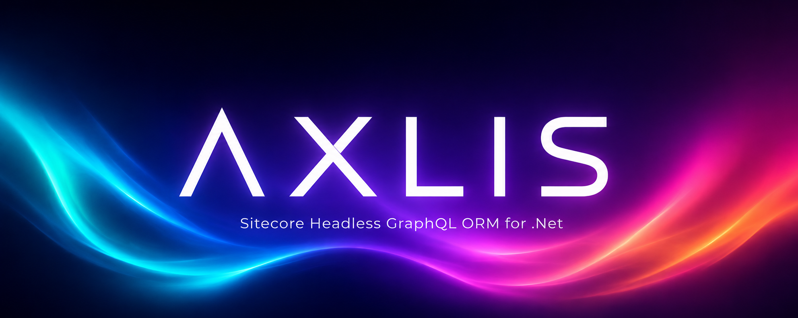

# Axlis



[](https://github.com/marioarce/Axlis/actions/workflows/ci.yml)
[](https://www.nuget.org/packages/Axlis)
[](https://www.nuget.org/packages/Axlis.Core)
[](LICENSE)

**Axlis** is a Sitecore Headless GraphQL ORM for .NET 8 — a strongly-typed, Synthesis-style item model built on raw `HttpClient` + `System.Text.Json`. No third-party GraphQL library required.

> Part of the [PowerCSharp](https://github.com/marioarce/PowerCSharp) ecosystem. Integrates with `PowerCSharp.Feature.Cache` for stampede-safe item caching.

---

## Package Family

| Package | Description | TFMs |
|---|---|---|
| [`Axlis`](https://www.nuget.org/packages/Axlis) | Facade, cache manager, DI wiring (`AddAxlis`) | `net8.0` |
| [`Axlis.GraphQL`](https://www.nuget.org/packages/Axlis.GraphQL) | Default `HttpClient`+STJ transport, `SitecoreService`, query builder | `net8.0` |
| [`Axlis.Core`](https://www.nuget.org/packages/Axlis.Core) | Domain model, field types, `ExtendedItem`, `AxesAdapter`, `ItemConverter` | `net8.0` |
| [`Axlis.Abstractions`](https://www.nuget.org/packages/Axlis.Abstractions) | Contracts, NoOps, `AxlisResult<T>`, codegen-hook attributes | `netstandard2.0` + `net8.0` |

---

## Install

```bash
dotnet add package Axlis
dotnet add package Axlis.GraphQL
```

Or à la carte — reference only what you need.

---

## Quick Start

```csharp
// Program.cs
builder.Services.AddAxlis(builder.Configuration);

// appsettings.json
{
  "Axlis": {
    "GraphQL": {
      "BaseAddress": "https://your-sitecore-instance/sitecore/api/graph/edge"
    }
  }
}
```

```csharp
// Your strongly-typed template
[SitecoreTemplate("{6D1CD897-1936-4A3A-A511-289A94C2A7B1}")]
public class DictionaryEntry : ExtendedItem
{
    [SitecoreField("Key")]
    public TextField Key => GetField<TextField>("Key");

    [SitecoreField("Phrase")]
    public TextField Phrase => GetField<TextField>("Phrase");
}

// Fetch an item
var item = await facade.GetItemByPathAsync<DictionaryEntry>("/sitecore/content/dictionary/my-key");
Console.WriteLine(item?.Phrase.RawValue);

// Axes traversal
var children  = item?.Axes.Children;
var parent    = item?.Axes.Parent;
var siblings  = item?.Axes.Siblings;

var pages = item?.Axes.GetChildren(i => i.InnerItem?.Template?.Equals(MyPage.TemplateId) ?? false);

// Rich result with metadata and diagnostics
var result = await facade.GetItemByPathWithResultAsync<DictionaryEntry>("/sitecore/content/dictionary/my-key");
Console.WriteLine(result.Metadata?.ItemPath);
```

---

## Sample App

See **[Axlis.CleanArchitecture.Sample](https://github.com/marioarce/Axlis.CleanArchitecture.Sample)** — a full working consumer built on [PowerCSharp.CleanArchitecture](https://github.com/marioarce/PowerCSharp.CleanArchitecture).

---

## Documentation

Full docs live in [`/docs`](docs/):

- [Architecture](docs/Architecture.md)
- [Getting Started](docs/GettingStarted.md)
- [Templates Guide](docs/Templates.md)
- [Axes Guide](docs/Axes.md)
- [Caching](docs/Caching.md)

---

## Contributing

See [CONTRIBUTING.md](CONTRIBUTING.md) for branch strategy, commit format, and PR checklist.

## License

MIT — see [LICENSE](LICENSE).